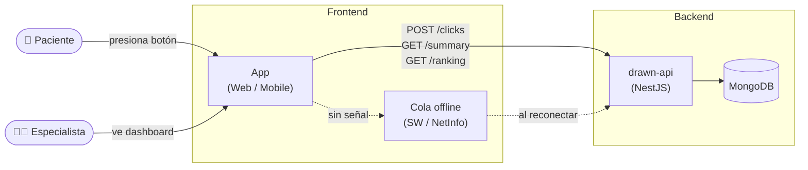

# Drawn — MindShift

Sistema de registro de ansiedad Mindshift. Pacientes presionan un botón para registrar episodios de ansiedad. Especialistas podrán acceder eventualmente a totales y rankings por rango de fechas.

---

## Stack

| Capa | Tecnología |
|---|---|
| **API** | NestJS 11 + MongoDB (Mongoose) |
| **Auth** | JWT + bcrypt |
| **Web** | React + Vite (PWA) |
| **Mobile** | React Native + Expo |
| **Offline Web** | Service Worker + Background Sync + IndexedDB |
| **Offline Mobile** | NetInfo + AsyncStorage |
| **Seguridad Mobile** | expo-secure-store |

---

## Estructura del monorepo

```
Drawn/
├── drawn-api/     # NestJS backend
├── drawn-web/     # React PWA
└── drawn-app/     # React Native (Expo)
```

---

## Diagrama


## Arquitectura



**drawn-api** usa arquitectura MVC modular plana:

```
src/modules/
├── auth/      # login, register, JWT, bcrypt
├── users/     # schema + service
└── clicks/    # registro, summary, ranking
```

---

## Endpoints

| Método | Ruta | Auth | Rol | Descripción |
|---|---|---|---|---|
| POST | `/auth/register` | No | — | Crea usuario paciente |
| POST | `/auth/login` | No | — | Login → JWT |
| POST | `/clicks` | JWT | patient | Registra un click |
| GET | `/clicks/summary?from=&to=` | JWT | specialist | Total de clicks en rango |
| GET | `/clicks/ranking?from=&to=&limit=` | JWT | specialist | Top pacientes por clicks |

---

## Seguridad implementada

- JWT con expiración y validación estricta
- bcrypt con 10 rounds
- Registro siempre crea rol `patient` — especialistas se asignan manualmente
- `summary` y `ranking` protegidos por rol `specialist`
- Rate limiting: 10 req/min en endpoints de auth (brute force)
- CORS restringido por variable de entorno `ALLOWED_ORIGINS`
- Interceptor 401 en web y mobile — redirige al login automáticamente
- JWT almacenado en `expo-secure-store` (encriptado) en mobile
- Validación de inputs con `class-validator` + `ValidationPipe`
- Password mínimo 8 caracteres + confirmación en registro

---

## Offline

### Web (PWA)
Service Worker custom con **Background Sync API**:
- Intercepta `POST /clicks` fallidos
- Guarda en **IndexedDB**
- El browser despierta el SW automáticamente cuando vuelve la red, aunque la pestaña esté cerrada

### Mobile (React Native)
Cola con **NetInfo + AsyncStorage**:
- Click fallido → guardado en AsyncStorage
- NetInfo detecta reconexión → reenvía toda la cola
- Funciona mientras la app está abierta o en primer plano

---

## Escala

Stress test local con 100 conexiones concurrentes durante 30 segundos:

| Métrica | Resultado |
|---|---|
| Requests totales | 28.000 en 30s |
| Throughput | ~934 req/s |
| Latencia p50 | 101ms |
| Latencia p99 | 159ms |
| Errores | 0 |

El requerimiento es 10.000 req/s. El cuello de botella es MongoDB (1 write por click). La solución es infraestructura, no código: replica set + sharding, o un buffer Redis/Kafka delante de Mongo. El código del API no cambia.

---

## Variables de entorno

**drawn-api/.env**
```
MONGODB_URI=mongodb://localhost:27017/drawn
JWT_SECRET=change_this_in_production
JWT_EXPIRES_IN=7d
PORT=3000
ALLOWED_ORIGINS=http://localhost:5173,http://localhost:4173
```

**drawn-web/.env**
```
VITE_API_URL=http://localhost:3000
```

**drawn-app/.env**
```
EXPO_PUBLIC_API_URL=http://localhost:3000
```

---

## Cómo correr el proyecto

```bash
# API
cd drawn-api && yarn && yarn start:dev

# Web
cd drawn-web && yarn && yarn dev

# Mobile (web)
cd drawn-app && yarn && yarn web

# Mobile (dispositivo) — requiere cuenta expo.dev
eas build -p android --profile preview
```

---

## Screenshots

> _Login web_
<!-- screenshot aquí -->

> _Pantalla principal web_
<!-- screenshot aquí -->

> _App mobile en dispositivo_
<!-- screenshot aquí -->

> _Contador offline_
<!-- screenshot aquí -->

---

## Pendiente / Futuro

- Dashboard de especialistas (web) — pendiente de confirmación con cliente
- Background Fetch en mobile para envío con app cerrada
- httpOnly cookies en web (tradeoff actual: necesario para el Service Worker)
- Tests unitarios en drawn-web (Vitest)
- Deploy en producción (Railway/Render + MongoDB Atlas)


## Imagenes


## Consideraciones:

Mongo:

1) Inicialmente pensé en hacer que el endpoint actualziara un contador a nivel de usuario, sin embargo esa alternativa era mala idea por temas de responsabilidad. No tenia sentido que el cotnador estuviese dentro del usuario y se actualizara el documento.
2) Tome un approach mas agresivo y consideré centralizarlo a nivel de una sola coleccion por dia y que todos los usuarios tocaran ese documento, sin embargo ahi me acordé de que mongo acepta un maximo de 16mb por documento. Si todos llenasen uno solo y además se le pega en grandes cantidades al endpoint podría colapsar y perder mas datos.
3) Posteriormente, me parecio que la mejor idea era tener una coleccion de clicks donde guardara todos los clicks de cada usuario. Iba a hacerlo de forma infinita, pero lo descarté porque es un antipatron en mongo crear arrays infinitamente crecientes. https://www.mongodb.com/es/docs/atlas/schema-suggestions/avoid-unbounded-arrays/
4) Finalmente decanté por un bucket diario que se crea la primera vez que el usuario clickea el botón. Ese bucket esta creado al inicio del dia con un calculo de UTC offset para evitar problemas cuando se quisiera buscar desde un from a un to.

App: 

1) A medida que iba desarrollando me di cuenta que habian casos que obvie al momento de proponer la solucion. Primero, desconocía que existia una necesidad de inscripciones/sub para poder publicar una app. En el caso de android es free, pero no así para Iphone que cuesta 100usd para poder subir la app.
2) Ya que no tenía claro si es que se podia extender el alcance de tal forma que se consideraba que podiamos gastar los 100 usd extras, decanté por crear una PWA para que al menos el MVP pudiese funcionar en ambos dispositios.
3) Dentro de lo mismo, me di cuenta que el concepto de Service Worker es exclusivo de las aplicaciones que usan browser por lo que me enfrenté en buscarle una vuelta a algo similar en la aplicación hecha con React Native. Esto lo resolvi con NetInfo, el cual escucha los cambios de conectividad del dispositivo. Eso permite que, al momento de no tener net, se encolan los clicks y despues cuando esta disponibles los inserta.
4) Dicho todo esto, cree ambas posibilidades. Si pagar una cuenta de 100 usd es posible, podemos usar el codigo de react native el cual puede ser mas robusto en terminos de los componentes del dispositivos o, si no hace falta, podemos utilizar la PWA.

API : 

1) Inicialmente implemnté una arquitectura hexagonal, pero me parecio un overkill para el caso.
2) Dado que no teniamos una necesidad de algo tan robusto use la arquitectura que conozco que es la MVC por capas, la cual es suficiente para satisfacer el alcance.
3) Implemente seguridad de token y guards basicos, además de los roles que protegen en caso de que alguien quisiese golpear un endpoint que no es permitido por el rol.


